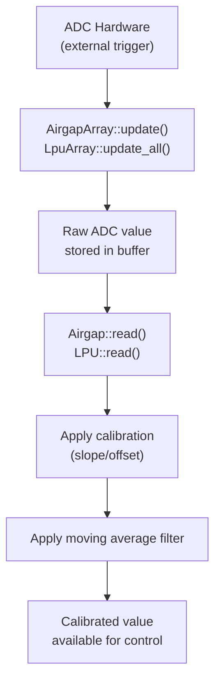
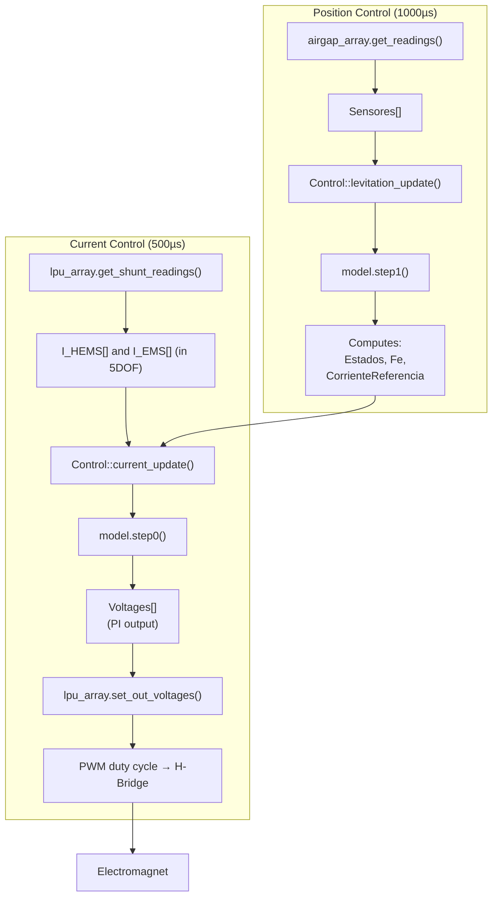
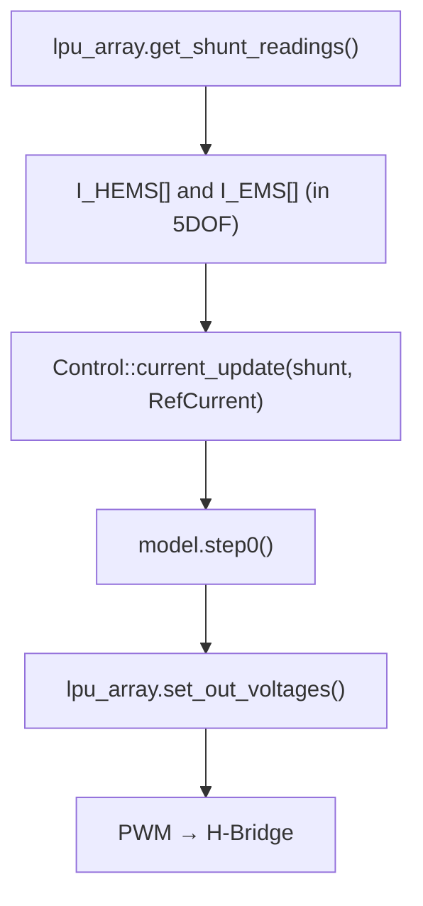
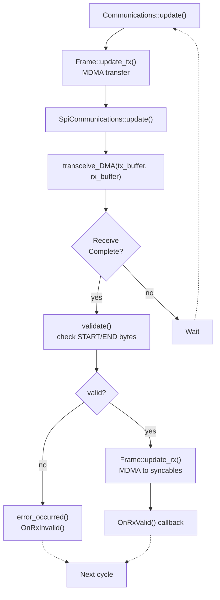
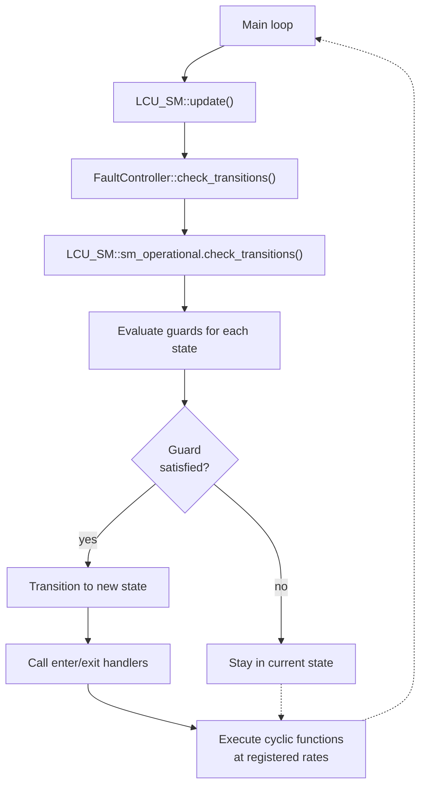

Trace information flow through the LCU-Slave firmware

## Overview

This command helps understand how data flows through the system, from hardware sensors through control algorithms to SPI communication with the Master.

## Flow 1: Sensor Reading

## Flow 2: Control Algorithm

### Levitation State (full control)

### Current Control State (direct current)

## Flow 3: SPI Communication

### Uplink Data (Slave → Master)

| Data            | Source                        |
| --------------- | ----------------------------- |
| LPU voltages    | `lpu_array.vbat_v[]`          |
| LPU currents    | `lpu_array.shunt_v[]`         |
| LPU duty cycles | `lpu_array.duty_cycle[]`      |
| Airgap readings | `airgap_array.airgap_v[]`     |
| Current state   | `state_machine.current_state` |
| Control outputs | `control.output.*`            |
| Diagnostics     | `report.*`                    |

### Downlink Data (Master → Slave)

| Data              | Destination                      |
| ----------------- | -------------------------------- |
| Desired state     | `state_machine.desired_state`    |
| Z reference       | `control.input.RefZ`             |
| Current reference | `control.input.RefCurrent`       |
| Ramp step         | `control.input.ramping`          |
| Manual mode       | `control.input.ManualLevitacion` |

## Flow 4: State Machine Transitions

*Fault may be entered from anywhere in the program*

## Key Files for Each Flow

| Flow           | Files                                                                                      |
| -------------- | ------------------------------------------------------------------------------------------ |
| Sensor reading | `Core/Inc/Airgap/Airgap.hpp`, `Core/Inc/LPU/LPU.hpp`                                       |
| Control        | `Core/Inc/Control/Control.hpp`, `deps/LCU-Control-H11/ControlTop/`                         |
| SPI comms      | `deps/LCU-Shared-H11/Inc/FrameShared.hpp`, `deps/LCU-Shared-H11/Inc/SpiCommunications.hpp` |
| State machine  | `Core/Inc/StateMachine/LCU_StateMachine.hpp`, `Core/Src/StateMachine/LCU_StateMachine.cpp` |