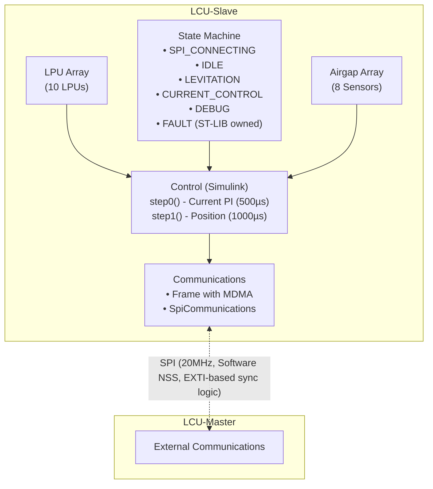

# AGENTS.md

## Project Overview

This is the **LCU-Slave-H11** firmware for the Levitation Control Unit's Slave microcontroller.
The Slave MCU handles hardware I/O and control algorithms, while communicating with the Master MCU via SPI.

**Key components:**
- **LCU-Slave** (this repo): Hardware control, sensor reading, actuator control
- **LCU-Shared-H11** (submodule): Shared SPI and Frame communication code
- **LCU-Control-H11** (submodule): Auto-generated Matlab/Simulink control algorithms
- **ST-LIB** (submodule): Hardware abstraction library for STM32H723ZGT6

## Architecture Summary



## Build Modes

The project supports 3 degrees-of-freedom (DOF) configurations:

| Mode | LPUs | Airgaps | Description                                                 |
| ---- | ---- | ------- | ----------------------------------------------------------- |
| 1DOF | 1    | 1       | Single vertical axis                                        |
| 3DOF | 4    | 4       | 1 translational axis + 2 rotational (Z + Pitch + Roll)      |
| 5DOF | 10   | 8       | 2 translational + 3 rotational (Z + Y + Pitch + Roll + Yaw) |

Presets follow naming pattern: `{simulator,nucleo,board}-{debug,relwithdebinfo,release}-{1dof,3dof,5dof}`

```sh
./hyper build main --preset board-release-3dof
```

## Important Conventions

### Compile-Time Configuration
- DOF mode is selected via CMake options (`USE_1_DOF`, `USE_3_DOF`, `USE_5_DOF`)
- Virtual-to-physical mapping defined in `Core/Inc/Config/LCUHardwareConfig.hpp`
- Hardware is always 10 LPU connectors and 8 airgap connectors; only relevant ones are activated

### ST-LIB Integration
- Uses compile-time HAL abstraction (no runtime polymorphism)
- All peripherals are first constexpr requests that get passed to `Board`
- Peripherals instances are populated via `Board::instanceof<req>()` to get the runtime request
- MDMA used for zero-copy SPI transfers from DTCM memory (main program stack and heap, only MDMA has access there besides the CPU) to D1 ram (where the DMA can take it to the SPI peripheral)

## Key Files

### Core Application
- `Core/Inc/LCU_SLAVE.hpp` - Hardware declarations
- `Core/Src/LCU_SLAVE.cpp` - Main initialization
- `Core/Src/main.cpp` - Entry point, no logic here

### State Machine
- `Core/Inc/StateMachine/LCU_StateMachine.hpp`
- `Core/Src/StateMachine/LCU_StateMachine.cpp`

### Control
- `Core/Inc/Control/Control.hpp` / `.cpp` - Control wrapper
- `deps/LCU-Control-H11/ControlTop/` - Simulink code API (do not edit), calls the actual underlaying control

### Communications
- `Core/Inc/Communications/Communications.hpp` / `.cpp` - Integration code, main logic in the Shred project
- `deps/LCU-Shared-H11/Inc/FrameShared.hpp`
- `deps/LCU-Shared-H11/Inc/SpiCommunications.hpp`

### Hardware Drivers
- `Core/Inc/LPU/LPU.hpp` - Levitation Power Unit
- `Core/Inc/Airgap/Airgap.hpp` - Airgap sensor

## Common Tasks

### Building
```sh
./hyper build main --preset simulator           # Fast simulation, may not work right now
./hyper build main --preset board-release-3dof  # Hardware, 3DOF
```

### Adding new SPI syncable data
1. Implement `get_uplink_layout()` and `get_downlink_layout()` in your base class, defined in the Shared project
2. Derive the Base class if needed in the main project, or direclty instantiate it
3. Add to Frame template in `ConfigShared.hpp`
4. Add to Frame init in `LCU_SLAVE.hpp`

### Modifying control algorithm
1. Not available right now

## Documentation

- Main docs: `docs/template-project/` (setup, build-debug, testing)
- ST-LIB docs: `deps/ST-LIB/docs/`
- Shared repo: `deps/LCU-Shared-H11/README.md`

## Dependencies

This repo uses git submodules. After cloning:
```sh
git submodule update --init
./hyper init
```

Key submodules:
- `deps/ST-LIB/` - STM32 hardware abstraction
- `deps/LCU-Shared-H11/` - Shared SPI/Frame code
- `deps/LCU-Control-H11/` - Auto-generated control