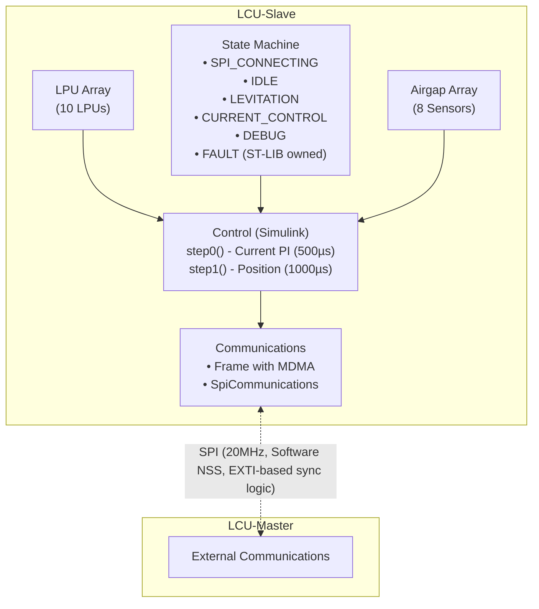
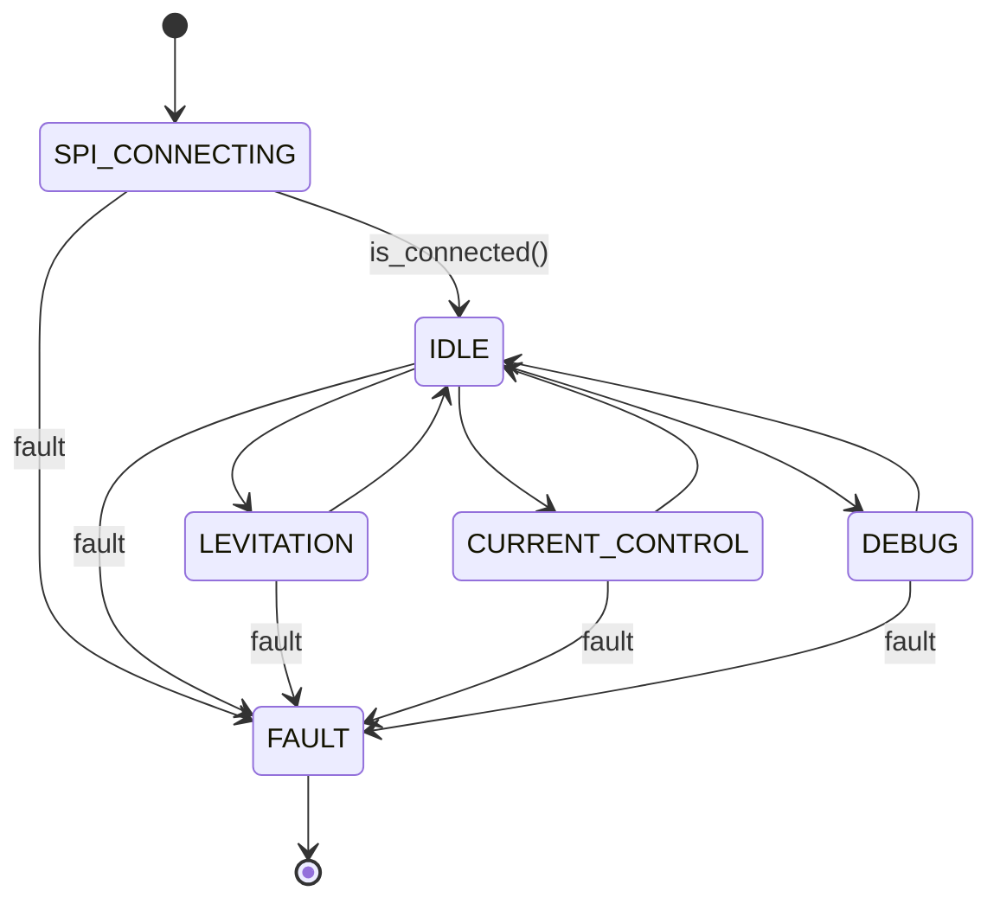
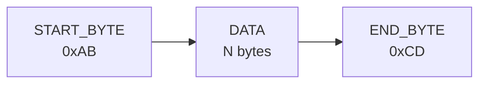
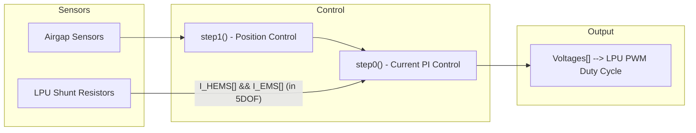

# LCU-Slave Architecture

## Overview

The Levitation Control Unit (LCU) consists of two microcontrollers:
- **Master MCU**: Owns external communications (ethernet, can, etc.)
- **Slave MCU** (this firmware): Owns hardware I/O and control algorithms

Communication between Master and Slave occurs via SPI with a Frame-based protocol.

## Hardware Abstraction



## Degrees of Freedom (DOF) Modes

The system supports three operational modes:

| Mode | LPUs | Airgaps | Description                                                 |
| ---- | ---- | ------- | ----------------------------------------------------------- |
| 1DOF | 1    | 1       | Single vertical axis                                        |
| 3DOF | 4    | 4       | 1 translational axis + 2 rotational (Z + Pitch + Roll)      |
| 5DOF | 10   | 8       | 2 translational + 3 rotational (Z + Y + Pitch + Roll + Yaw) |

Virtual-to-physical mapping is defined in `Core/Inc/Config/LCUHardwareConfig.hpp`.

## State Machine


*Master requests states via `desired_state` field in SPI downlink*
*FAULT state is terminal and owned by ST-LIB*

### State Details

| State           | Cyclic Action                      | Frequency |
| --------------- | ---------------------------------- | --------- |
| SPI_CONNECTING  | Check GPIO master_fault            | 500ms     |
| IDLE            | Monitor master fault               | 100ms     |
| LEVITATION      | Current control                    | 500µs     |
|                 | Position/levitation control        | 1000µs    |
| CURRENT_CONTROL | Current control (fixed RefCurrent) | 500µs     |
| DEBUG           | Update LPUs (no control)           | 1000µs    |
| FAULT           | Emergency shutdown                 | -         |

*Sensors are allways updated at 100µs*

### Fault Triggers
- GPIO master_fault pin goes LOW (detected via EXTI, and gpio read as fallback)
- SPI connection lost (while not in SPI_CONNECTING)
- FaultController (PANIC or FAULT called, or Protection triggered)
- Master sends FAULT desired_state (fallback, should be detected earlier by other means)

## Communications Protocol Overview

*Check communications.md for further information*

### Physical Layer
- **Interface**: SPI3
- **Mode**: SLAVE
- **Speed**: 20 MHz
- **NSS**: Software controlled (allways selected as long as it is ready)
- **DMA**: DMA1 Stream 5 (RX), DMA1 Stream 6 (TX)
- **Slave Ready**: GPIO that goes high when the Slave is ready to start a communication for synchronization with the master

### Frame Protocol



*Data payload is defined by the Frame Syncables*

### Syncables (Data Exchange)

| Component          | Uplink (-> Master)          | Downlink (<- Master)                        |
| ------------------ | --------------------------- | ------------------------------------------- |
| LPUArray (10 LPUs) | vbat_v, shunt_v, duty_cycle | is_fixed_vbat, fixed_vbat, fixed_duty_cycle |
| AirgapArray (8)    | airgap_v                    | (none)                                      |
| StateMachineBase   | current_state               | desired_state                               |
| ControlBase        | Control Logging             | RefZ, RefCurrent, ramping                   |
| ReportBase         | record, seq_num             | (none)                                      |

*LPU and Airgap counts depend on the compiled DOF*

## Control System

### Two-Step Execution Model (from Simulink RateGroup)

#### step0() - Current Control (Fast Rate: 500µs)
- **Purpose**: PI current controller for each LPU
- **Inputs**: `I_HEMS[]` (measured currents from shunt resistors)
- **Outputs**: `Voltages[]` (PWM voltage commands to LPUs)

#### step1() - Position Control (Slow Rate: 1000µs)
- **Purpose**: Position/levitation control using airgap sensors
- **Inputs**: `Sensores[]` (airgap readings), `RefZ` (position reference)
- **Outputs**: `CorrienteReferencia[]` (current references for step0)

### Control Flow



## Hardware Components

### LPU (Levitation Power Unit)
- PWM generation at 20kHz
- Current measurement via shunt resistor + ADC
- Voltage measurement via current going through a voltage divider + ADC
- Moving average filtering for noise reduction
- Calibration: slope/offset characterization

### Airgap Sensor
- Linear position sensor with offset/slope calibration
- 8-sample moving average filtering

## Key Files

| File                                             | Purpose                                    |
| ------------------------------------------------ | ------------------------------------------ |
| `Core/Inc/LCU_SLAVE.hpp`                         | Hardware declarations, Frame instantiation |
| `Core/Inc/Config/LCUHardwareConfig.hpp`          | DOF selection, virtual-to-physical mapping |
| `Core/Inc/StateMachine/LCU_StateMachine.hpp`     | State definitions                          |
| `Core/Src/StateMachine/LCU_StateMachine.cpp`     | State transitions, cyclic actions          |
| `Core/Src/LCU_SLAVE.cpp`                         | Main initialization                        |
| `Core/Inc/Control/Control.hpp`                   | Control wrapper                            |
| `deps/LCU-Shared-H11/Inc/FrameShared.hpp`        | Frame template, MDMA transfers             |
| `deps/LCU-Shared-H11/Inc/SpiCommunications.hpp`  | SPI state machine                          |
| `deps/LCU-Control-H11/ControlTop/ControlTop.cpp` | Auto-generated Simulink model              |
| `Core/Src/main.cpp`                              | Entry point                                |

## Build System

CMake with Ninja generator, presets defined in `CMakePresets.json`:

```sh
./hyper build main --preset simulator           # Fast simulation, may not work yet
./hyper build main --preset board-release-3dof  # Hardware, 3DOF
./hyper build main --preset board-release-5dof  # Hardware, 5DOF
```

Output: `out/build/latest.elf`