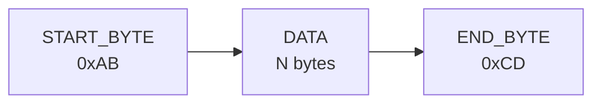
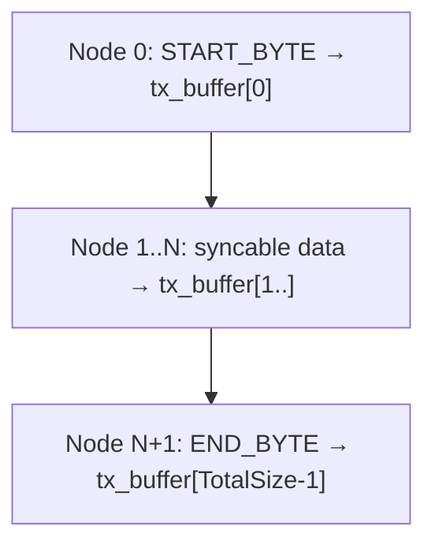
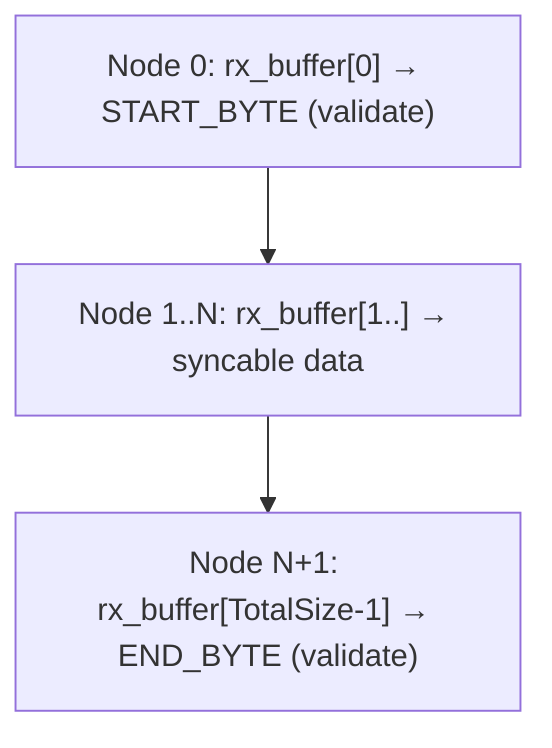
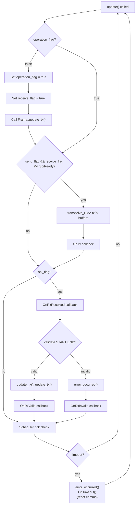
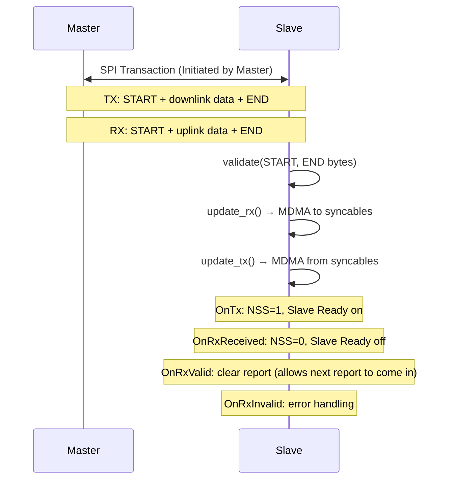

# SPI/Frame Communications Protocol

## Overview

The Master and Slave microcontrollers communicate via SPI using a Frame-based protocol.
The Frame uses MDMA for zero-copy memory transfers, enabling efficient real-time data exchange
without CPU intervention.

## Physical Layer

| Parameter  | Value                                                         |
| ---------- | ------------------------------------------------------------- |
| Peripheral | SPI3                                                          |
| Mode       | SLAVE                                                         |
| Speed      | 20 MHz                                                        |
| NSS        | Software controlled (allways selected as long as it is ready) |
| RX DMA     | DMA1 Stream 5                                                 |
| TX DMA     | DMA1 Stream 6                                                 |

## Frame Structure

- **START_BYTE**: 0xAB (frame synchronization marker)
- **DATA**: Variable length based on DOF mode and syncables
- **END_BYTE**: 0xCD (frame validation marker)
- Buffers are aligned to 32 bytes for MDMA compatibility
- Size and structure must match in both Master and Slave MCU

## Data Exchange (Syncables)

Each component with data to exchange implements two methods:
- `get_uplink_layout()`: Returns data to send TO master
- `get_downlink_layout()`: Returns data to receive FROM master

### LCU-Slave Syncables

| Component            | Uplink (→ Master)                                                               | Downlink (← Master)                                                  |
| -------------------- | ------------------------------------------------------------------------------- | -------------------------------------------------------------------- |
| **LPUArray**         | vbat_v[10], shunt_v[10], duty_cycle[10]                                         | is_fixed_vbat[10], fixed_vbat[10], fixed_duty_cycle[10]              |
| **AirgapArray**      | airgap_v[8]                                                                     | (none)                                                               |
| **StateMachineBase** | current_state (1 byte)                                                          | desired_state (1 byte)                                               |
| **ControlBase**      | Voltages[10], Estados[5], GapsLocales[4], Fe[3], Fa[4], P[3], R[3], Zz[3], etc. | RefZ, RefCurrent, ramping                                            |
| **ReportBase**       | record (424 bytes), seq_num (4 bytes)                                           | (none)                                                               |

*LPU and Airgap counts depend on the compiled DOF*

### Example Frame Sizes (5DOF mode)

| Syncable           | Uplink Size                               | Downlink Size |
| ------------------ | ----------------------------------------- | ------------- |
| LPUArray (10 LPUs) | 120 bytes                                 | 90 bytes      |
| AirgapArray (8)    | 32 bytes                                  | 0 bytes       |
| StateMachineBase   | 1 byte                                    | 1 byte        |
| ControlBase        | 288 bytes                                 | 9 bytes       |
| ReportBase         | 428 bytes (may not be completely correct) | 0 bytes       |
| **Total**          | 869 bytes                                 | 100 bytes     |
| **Frame Size**     | 871 bytes (max + 2 for start/end)         |               |

## MDMA Transfer

The Frame uses MDMA (Memory DMA) for zero-copy transfers from DTCM (main program memory) to D1 (DMA accessible for the SPI):

### TX Node Chain (Uplink)

### RX Node Chain (Downlink)

## SPI State Machine

Defined in `SpiCommunications.hpp`:

| Flag             | Purpose                |
| ---------------- | ---------------------- |
| `send_flag`      | TX transfer pending    |
| `receive_flag`   | RX transfer pending    |
| `operation_flag` | Bootstrap completed    |
| `spi_flag`       | SPI operation complete |

### update() Flow

### Error Handling

- **Error**: Publishes a warning
- **Max Errors exceeded**: Fault

## Communication Flow Diagram

## Key Files

| File                                             | Purpose                                                    |
| ------------------------------------------------ | ---------------------------------------------------------- |
| `deps/LCU-Shared-H11/Inc/FrameShared.hpp`        | Frame template, MDMA linked list nodes, layout calculation |
| `deps/LCU-Shared-H11/Inc/SpiCommunications.hpp`  | SPI state machine, update logic, error handling            |
| `deps/LCU-Shared-H11/Inc/SpiShared.hpp`          | SPI configuration (software NSS mode)                      |
| `deps/LCU-Shared-H11/Inc/ControlShared.hpp`      | ControlBase with input/output structures                   |
| `deps/LCU-Shared-H11/Inc/StateMachineShared.hpp` | SlaveState enum, state exchange                            |
| `deps/LCU-Shared-H11/Inc/LPUShared.hpp`          | LPUBase with voltage/current telemetry                     |
| `deps/LCU-Shared-H11/Inc/AirgapShared.hpp`       | AirgapBase with position data                              |
| `deps/LCU-Shared-H11/Inc/ReportShared.hpp`       | Diagnostic record exchange                                 |
| `Core/Inc/Communications/Communications.hpp`     | SPI comms initialization                                   |
| `Core/Src/Communications/Communications.cpp`     | SPI callbacks definition                                   |