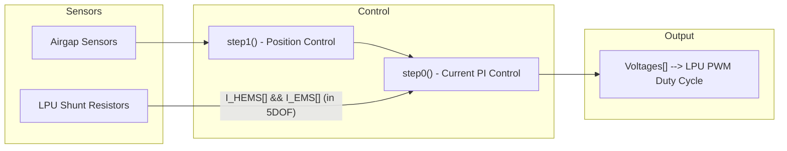

# Control System

## Overview

The control system is implemented as a two-step execution model based on Simulink's RateGroup scheduling. The control algorithms are auto-generated from Matlab/Simulink models and should not be modified manually.

## Two-Step Execution Model

### step0() - Current Control (Fast Rate: 500µs)

- **Purpose**: PI current controller for each LPU (Levitation Power Unit)
- **Execution**: In LEVITATION and CURRENT_CONTROL states
- **Inputs**: `I_HEMS[]` and `I_EMS[]` (in 5DOF) - measured currents from shunt resistors
- **Outputs**: `Voltages[]` - PWM voltage commands to LPUs

### step1() - Position Control (Slow Rate: 1000µs)

- **Purpose**: Position/levitation control using airgap sensors
- **Execution**: In LEVITATION state only
- **Inputs**: `Sensores[]` (airgap readings), `RefZ` (position reference)
- **Outputs**: `CorrienteReferencia[]` - current references for step0

## Data Flow

## Simulink Sub-Models

### Position control

Converts 8 airgap sensor readings into 3D position estimation and generates force commands:

1. **Position Estimation**: Convert 8 airgap sensors to 3D position (x, y, z, roll, pitch, yaw)
2. **Force Calculation**: Uses LUTs to get desired forces based on gap + current
3. **Force Errors**: Compute `Ef`
4. **Cascade Control**: Z-error → Z-force → actuator forces
5. **Current References**: Use inverse LUT (InvLUT) to convert forces to current references

### Current PI Controller

Closed-loop current control per LPU:

1. Compute error: `CorrienteRef - I_real`
2. P term: `15.0 * error`
3. I term: `integrator += 0.00025 * error` (0.25ms sample time)
4. Anti-windup: Clamp integrator to ±350
5. Output: `P + I`, clamped to ±350V

*Constants are based on a specific version of the control, they may change*

## Control Data Structures

### ExtU_ControlTop_T (Inputs)

| Field                | Type   | Description                    |
| -------------------- | ------ | ------------------------------ |
| `Sensores[]`         | real_T | Airgap sensor readings         |
| `I_HEMS[] and I_EMS` | real_T | Measured currents from shunts  |
| `RefZ`               | real_T | Z-axis position reference      |
| `ManualLevitacion`   | real_T | Manual levitation enable (0/1) |
| `CorrienteManual`    | real_T | Manual current setpoint        |
| `RampaStep`          | real_T | Ramping step enable (0/1)      |
| `enable`             | real_T | Control enable (0/1)           |

### ExtY_ControlTop_T (Outputs)

| Field                   | Type   | Size                                     |
| ----------------------- | ------ | ---------------------------------------- |
| `Voltages[]`            | real_T | LPU voltage commands                     |
| `CorrienteReferencia[]` | real_T | Current references                       |
| `Estados[]`             | real_T | Position states (x, y, roll, pitch, yaw) |
| `GapsLocales[]`         | real_T | Local airgap values                      |
| `Fe[]`, `Fa[]`, `Ef[]`  | real_T | Force-related values                     |
| `P[]`, `R[]`, `Zz[]`    | real_T | Pitch, Roll, Z estimates                 |
| `Fe_L[]`                | real_T | Local forces                             |
| `A[]`, `Ak[]`, `Bk[]`   | real_T | Lookup table indices                     |
| `Referencia`            | real_T | Applied reference                        |

## Control Wrapper

The `Control` class in `Core/Inc/Control/Control.hpp` wraps the Simulink model

## Manual vs Automatic Mode

### Levitation Mode (`levitation_update()`)
- `ManualLevitacion = 1.0` enables position control
- Uses `RefZ` as position reference
- Airgaps feed into position estimation

### Manual Current Mode (`current_update()` with desired_current)
- `ManualLevitacion = 0.0` bypasses position control
- `CorrienteManual` directly sets current reference
- Used for testing/debugging

## Key Files

| File                                               | Purpose                        |
| -------------------------------------------------- | ------------------------------ |
| `Core/Inc/Control/Control.hpp`                     | Control wrapper class          |
| `Core/Src/Control/Control.cpp`                     | Control wrapper implementation |
| `deps/LCU-Control-H11/ControlTop/ControlTop.hpp`   | Simulink model interface       |
| `deps/LCU-Control-H11/ControlTop/ControlTop.cpp`   | Auto-generated Simulink model  |